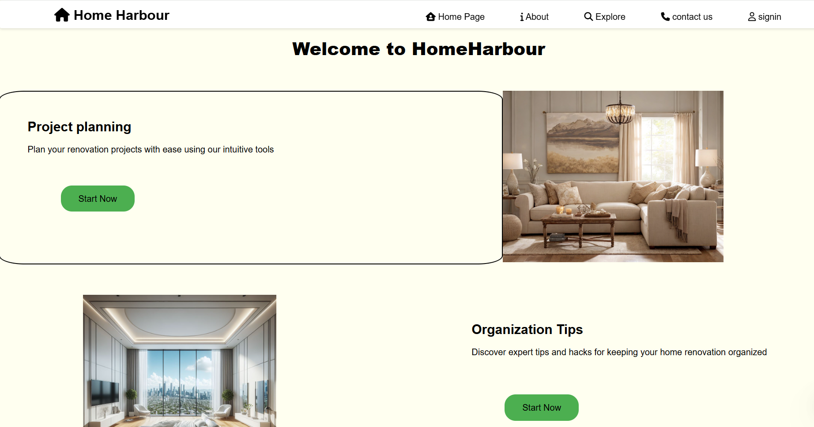
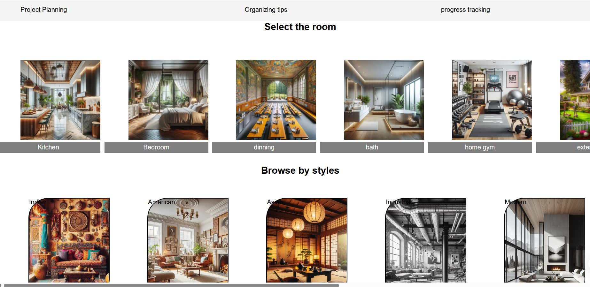
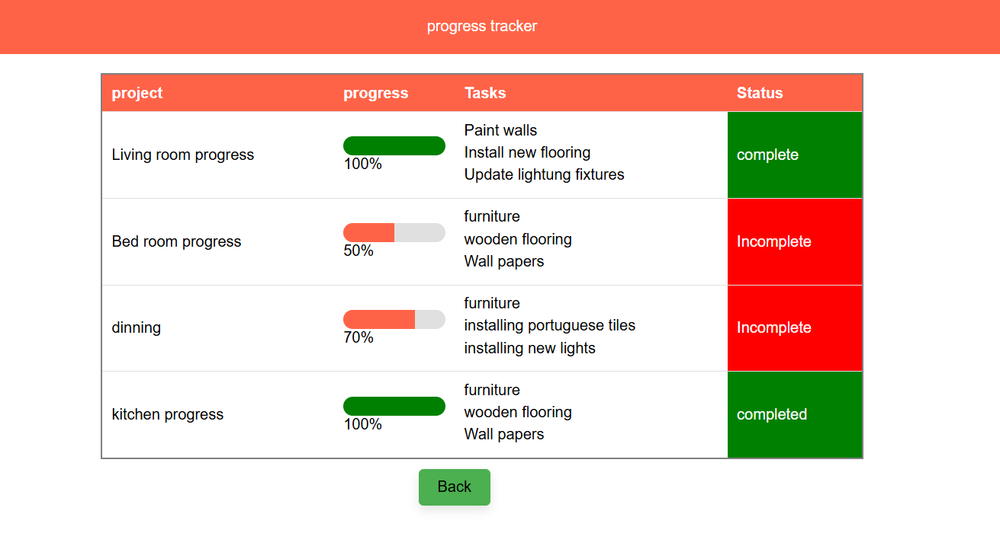

# HomeHarbour

**HomeHarbour** is a simple and elegant HTML & CSS-based dashboard designed to help you plan, organize, and track your home-related projects efficiently.

## ✨ Features

- 🏠 **Homepage** with intuitive navigation
- 📋 **Project Planning** section for organizing renovations
- 📚 **Organization Tips** to keep your home tidy and efficient
- 📈 **Progress Tracking** to monitor your tasks visually
- 📱 Fully responsive using basic HTML and CSS

## 📂 Tech Used

- HTML5
- CSS3
- Font Awesome Icons

## 💡 Getting Started

1. Clone or download the repo.
2. Open `index.html` (or `home.html`) in any browser.
3. Start exploring!

## 📸 Screenshots

---

© 2024 HomeHarbour. All rights reserved.
